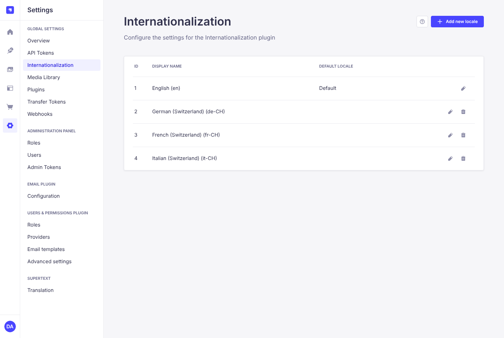
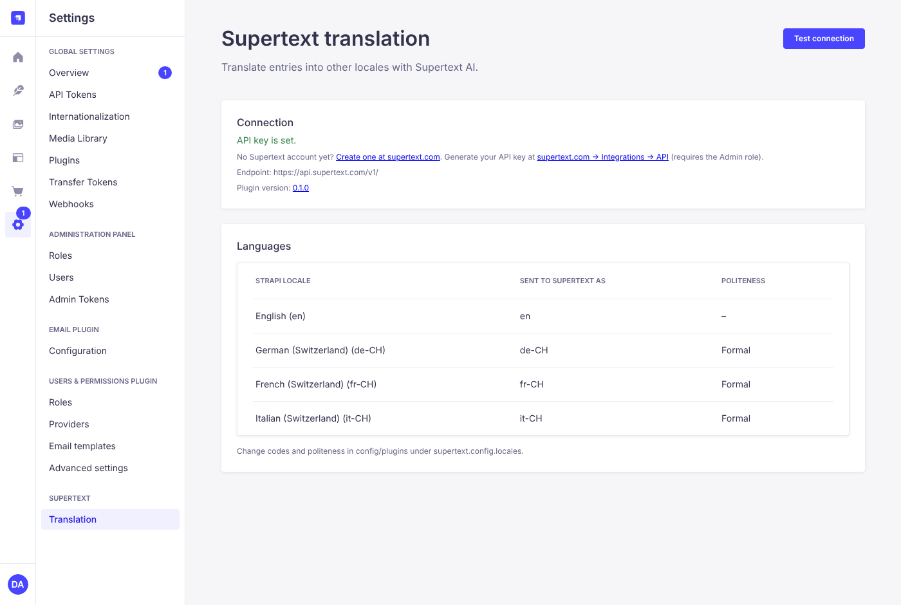

# Installation guide — Supertext Translation for Strapi

For administrators setting up the plugin in a Strapi project.

## Requirements

| | |
| --- | --- |
| Strapi | 5.x (tested with 5.56) |
| Node.js | 20 or newer (22 recommended) |
| Database | Any database Strapi supports (tested with SQLite; the demo runs on PostgreSQL) |
| Strapi i18n | Enabled for every content type you want to translate (*Content-Type Builder → Advanced settings → Internationalization*), with the target languages added under *Settings → Internationalization* |
| Supertext | An account with an API key — see [Get a Supertext account and API key](#get-a-supertext-account-and-api-key) |
| Network | The Strapi server must reach `https://api.supertext.com` over HTTPS |

The languages Supertext translates into are Strapi's own locales:



### Get a Supertext account and API key

1. **Account:** no Supertext account yet? [Log in or create a Supertext account](https://www.supertext.com/person/en/account/signin) with your email address.
2. **API key:** generate the AI API key at [supertext.com → Integrations → API](https://www.supertext.com/en/integrations/api). This page requires the **Admin** role in your Supertext account; if you don't have it, ask an admin of your Supertext account to generate the key.

The plugin's settings page (*Settings → Supertext → Translation*) shows the same two links.

## 1. Install the package

The plugin isn't on npm yet. Build it from GitHub and install the tarball:

```bash
git clone https://github.com/Supertext/Strapi-Supertext-Translation.git
cd Strapi-Supertext-Translation
npm ci && npm run build && npm pack
# → strapi-plugin-supertext-translation-<version>.tgz

cd /path/to/your-strapi-project
npm install /path/to/strapi-plugin-supertext-translation-<version>.tgz
```

Once it's published to npm this becomes `npm install strapi-plugin-supertext-translation`.

## 2. Enable and configure it

In `config/plugins.js` (or `.ts`):

```js
module.exports = ({ env }) => ({
  supertext: {
    enabled: true,
    config: {
      apiKey: env('SUPERTEXT_API_KEY'),
      // Optional: per-locale Supertext code and politeness, keyed by Strapi locale code
      locales: {
        'de-CH': { politeness: 'more' },   // formal: Sie
        'fr-CH': { politeness: 'more' },   // formal: vous
        'pt': { code: 'pt-BR' },           // send Strapi's "pt" to Supertext as pt-BR
      },
    },
  },
});
```

Set the key as an environment variable on the server, for example in `.env`:

```bash
SUPERTEXT_API_KEY=your-key
```

Never commit the key to the repository.

## 3. Rebuild and restart

```bash
npm run build
npm run start      # or: npm run develop
```

A new **Supertext translation** panel now appears in the right-hand column of every localized entry in the Content Manager, and **Settings → Supertext → Translation** shows the configuration and the installed plugin version (for example *Plugin version: 0.1.0*, linked to that release's notes on GitHub). Mention the version when you contact support.



## 4. Check it works

1. Open *Settings → Supertext → Translation* and click **Test connection**. You should see *Connected to Supertext.*
2. Open any saved entry of a localized content type, tick a locale in the Supertext panel and click **Translate with Supertext**.

## All settings

| Setting | Default | Purpose |
| --- | --- | --- |
| `apiKey` | `SUPERTEXT_API_KEY` env var | Supertext API key, with or without the `Supertext-Auth-Key ` prefix |
| `endpoint` | `SUPERTEXT_API_ENDPOINT` env var, else `https://api.supertext.com/v1/` | API base URL (`https://api.staging.supertext.com/v1/` for staging) |
| `locales` | `{}` | Per Strapi locale: `code` (Supertext target code, defaults to the Strapi locale code) and `politeness` (`more` = formal, `less` = informal, `default`) |
| `contentTypes` | `[]` (all localized types) | Allow-list of content-type UIDs, e.g. `['api::article.article']` |
| `pollIntervalMs` | `2000` | Time between status checks |
| `pollTimeoutMs` | `180000` | Maximum wait per translation |

## Permissions

The plugin follows the Content Manager's permissions: a user can translate an entry only if they may **read** its source locale and **create or update** each target locale. Use *Settings → Roles* to limit editors to certain locales as usual.

## Updating

Install the newer tarball (or `npm update strapi-plugin-supertext-translation` once on npm), then `npm run build` and restart. The version on the settings page shows which one is running.

## Uninstalling

Remove the `supertext` block from `config/plugins`, run `npm uninstall strapi-plugin-supertext-translation`, rebuild and restart. Existing translations stay as they are.

## Troubleshooting

| Message | Cause / fix |
| --- | --- |
| *Too many requests to Supertext* | The API's per-second limit was still exceeded after 4 automatic retries. Wait a moment and translate again. |
| *Supertext is not configured yet* / *No API key* | Set `SUPERTEXT_API_KEY` (or `config.apiKey`) and restart Strapi. No key yet? See [Get a Supertext account and API key](#get-a-supertext-account-and-api-key). |
| *Authentication failed* | The key is wrong or revoked. Generate a new one at [supertext.com → Integrations → API](https://www.supertext.com/en/integrations/api) (requires the Admin role). |
| *This content type is not localized* | Enable internationalization for the content type in the Content-Type Builder. |
| *not enabled for this content type* | The type isn't in `contentTypes`. |
| *No … version of this entry found. Save it first.* | The entry hasn't been saved in the source locale yet. |
| *Timed out waiting* | Very large entries; raise `pollTimeoutMs`. If Strapi runs behind a proxy, also raise its request timeout. |
| *Could not reach Supertext* | The server can't make outbound HTTPS calls; check firewall/proxy settings. |
| The panel doesn't appear | The entry is new (save it first), the content type isn't localized, or the admin panel wasn't rebuilt after installing. |

Errors are also written to the Strapi server log with the prefix `[supertext]`.
