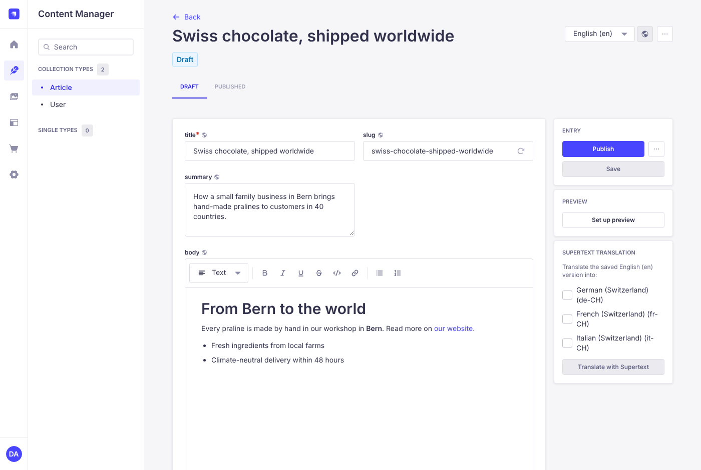
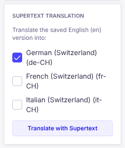
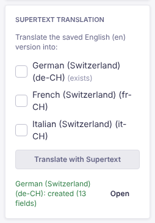
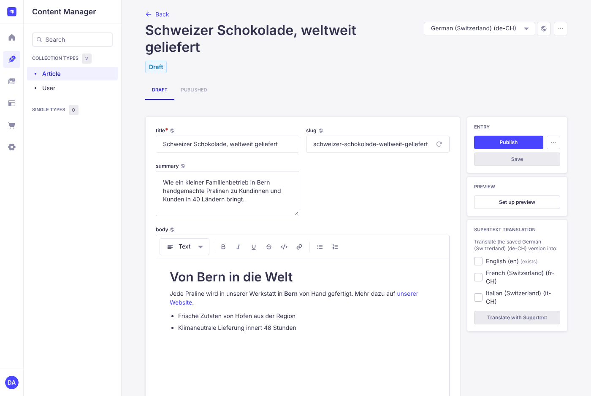
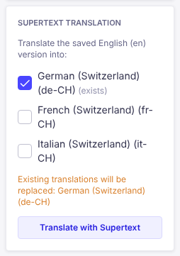

# User guide — Supertext Translation for Strapi

For editors. Once an administrator has installed the plugin (see [INSTALLATION.md](INSTALLATION.md)), you translate entries straight from the Content Manager.

*Screenshots are from the Strapi 5 demo in this repository.*

## Translate an entry

1. Open the entry in the **Content Manager** and make sure the language selector at the top right shows the language you want to translate **from** (usually your default language).
2. **Save** your changes. Supertext translates the saved version, not unsaved edits.
3. In the right-hand column, find the **Supertext translation** panel.
4. Tick the languages you want to translate **into**.
5. Click **Translate with Supertext**.

After a few seconds a green message confirms the result, and the panel lists each language, for example *French (Switzerland): created (13 fields)*. Click **Open** next to a language to jump to that translation.

## Review and publish

Translations are saved as **drafts**, so nothing goes live unreviewed.

1. Open the translation (**Open** in the panel, or the language selector at the top).
2. Read through it and adjust anything you'd phrase differently, then **Save**.
3. **Publish** when you're happy.

## Translating again

Languages that already have a translation are marked *(exists)*. If you tick one, the panel warns you that it will be **replaced**: all of its text is translated again from the current source. Use this after the source has changed a lot. To fix small things, edit the translation by hand instead, so your edits aren't lost.

When a translation is replaced, its URL slug is kept so existing links keep working. A new translation gets a slug built from its translated title.

## What gets translated

- Text fields: short text, long text, rich text (Markdown) and rich text (Blocks). Bold, italic, underline, strikethrough, inline code, links, headings, lists and quotes are kept.
- The same field types inside **components** and **dynamic zones**, for example SEO texts or page sections.
- Every field that is translated per language. Fields shared across all languages (marked as not localized) are left alone.

## What is *not* translated

- Code blocks in rich text, numbers, dates, booleans, e-mail addresses and option lists. These are copied from the source as they are.
- Images and files are linked to the same media as the source.
- **Relations** (links to other entries) are not set on new translations; set them by hand. Existing translations keep theirs.
- Unsaved changes. Save first.

## Formal and informal language

Your administrator can set each language to formal (*Sie/vous*) or informal (*du/tu*). The current setting is visible under *Settings → Supertext → Translation*.

## When something goes wrong

The panel shows the reason next to the language that failed, in red, and the other languages are still translated. Common reasons:

| Message | What to do |
| --- | --- |
| *Supertext is not configured yet* | Ask an administrator to add the API key (the [installation guide](INSTALLATION.md#get-a-supertext-account-and-api-key) explains how to get one). |
| *You may not edit these locales* | Your role can't edit that language. Ask an administrator. |
| *Your Supertext translation limit is exceeded* | The Supertext account's quota is used up. Contact your Supertext account manager. |
| *Timed out waiting* | Try again; for very long entries ask an administrator to raise the time limit. |

## Tips

- Translate into several languages at once; each language is one request to Supertext.
- Keep the source entry tidy (headings, lists) — the structure is carried over to every language.
